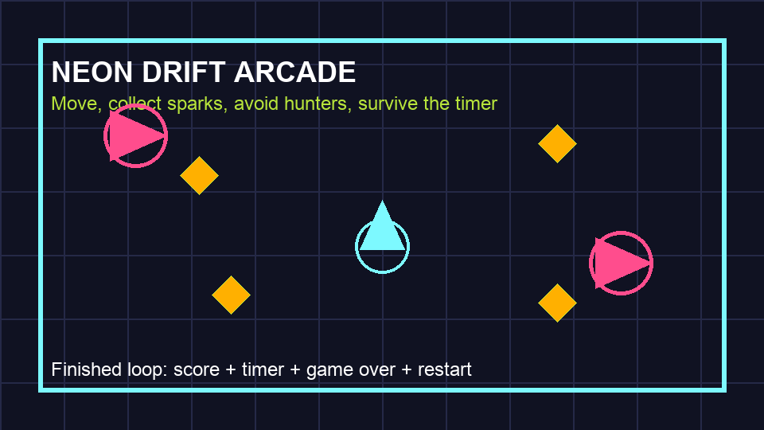

# Neon Drift Arcade

Build a small top-down arcade game in Godot 4. The style matches the Scratch arcade project: one small task per page, with a clear goal, short steps, and a check.

By the end, the game will have a player ship, an arena, sparks to collect, hunters to avoid, score, time, game over, feedback, and an exported build.

## What You Are Learning

While making Neon Drift, you will work towards these **BGE Fourth Level Computing
Science benchmarks**:

| Benchmark | I am learning to… |
| --- | --- |
| **TCH 4-13a** | explain how information moves between the player, game objects and computer. |
| **TCH 4-13b** | compare different algorithms and decide which solution is better for a task. |
| **TCH 4-14a** | use variables, calculations, sequence, selection and repetition in GDScript. |
| **TCH 4-14b** | explain how scenes, nodes, scripts, signals and the interface work together. |
| **TCH 4-15a** | plan, build, test, debug, improve and evaluate a working digital solution. |

[See the full learning grid and success criteria](learning-grid.md).

## What You Will Make

- A Godot project called `NeonDrift`.
- A player ship that moves with the keyboard.
- A neon arena with walls.
- Sparks that disappear when collected.
- Hunters that chase the player.
- A HUD with score and time.
- A game-over panel and restart button.
- A playable exported build.

## What You Need

- Godot 4 installed.
- A keyboard.
- A new empty folder for the project.

## How To Use This Guide

1. Open one task page.
2. Read the **Goal**.
3. Do only the steps on that page.
4. New Godot words are explained on the page before you need them.
5. Run the project when the page asks you to.
6. Move on when the **Check** works.

## Key Godot Words

| Word | Meaning |
| --- | --- |
| Project | The folder that stores one game. |
| Scene | One saved part of a game, such as a level, player, or collectible. |
| Node | One building block in a scene. Each node has one job. |
| Script | Code attached to a node. |
| Scene panel | The list at the top-left that shows the nodes in the open scene. |
| Inspector panel | The area on the right where you change the selected node's settings. |
| FileSystem panel | The area at the bottom-left that shows the files and folders in the project. |

## Start

[Start Lesson 1, Task 1: Create The Project](tasks/01-create-project.md)
