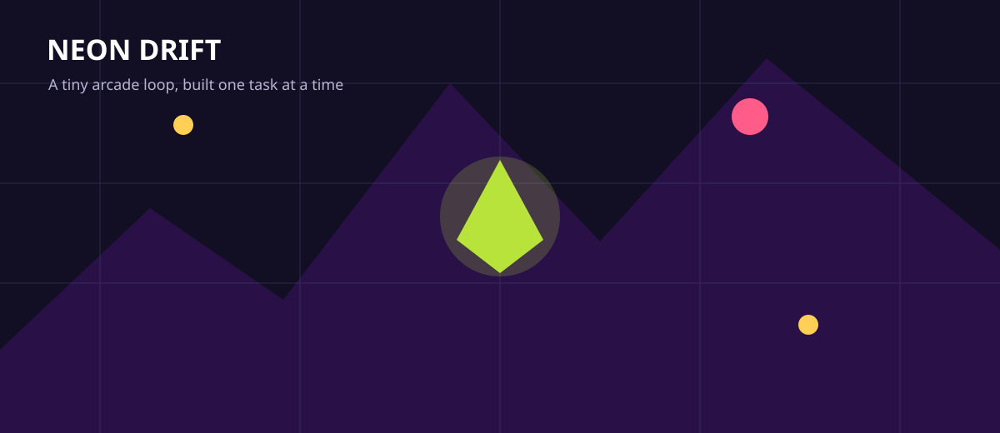

# Neon Drift Arcade

Build a tiny top-down arcade game in Godot 4. This guide is written for pupils and teachers who have never used Godot before.

Every task has its own page. Do not move to the next page until the checkpoint works.

<strong>Finished game:</strong> a 60-second arcade run where the player moves a glowing ship, collects sparks, avoids hunters, sees score and time, hears feedback, and can restart after game over.

{ .media-frame }

## Before You Start

### What Godot Is

Godot is a game engine. A game engine is software that helps you build games without writing every tiny system from nothing. It gives you windows, scenes, sprites, collision, sound, input, and export tools.

### The Three Words We Will Use Most

| Word | Meaning in this project |
| --- | --- |
| Scene | A saved object or screen, such as the player, a spark, or the whole game. |
| Node | One building block inside a scene. A player scene might contain a movement node, a picture node, and a collision node. |
| Script | Code attached to a node so it can do something. |

### How Lessons Should Run

1. Open one task page.
2. Read the goal and key words.
3. Watch the short video or teacher demonstration.
4. Complete the numbered steps.
5. Press Play and check the checkpoint.
6. Only then move to the next task.

!!! tip "Teacher rhythm"
    Model the first two or three clicks slowly. Pupils should say what they expect to happen before pressing Play. This turns errors into debugging practice instead of panic.

## Video Guide

Each task page includes a short animated lesson clip. You can replace these with teacher-made screen recordings later. Short clips work best: 30 to 90 seconds each.

| Task | Suggested clip |
| --- | --- |
| 01 | Creating a Godot project and saving the main scene |
| 02 | Adding a player scene and attaching a movement script |
| 03 | Drawing the arena and testing boundaries |
| 04 | Making sparks disappear with an Area2D |
| 05 | Making a hunter chase the player |
| 06 | Adding score, timer, and game over |
| 07 | Adding sound and visual feedback |
| 08 | Exporting a playable build |

The included clips live in `docs/assets/videos/`.

## The Route

| Page | Task | Pupils make |
| --- | --- | --- |
| 01 | [Project pulse](tasks/01-project-pulse.md) | A project that opens and runs |
| 02 | [Player movement](tasks/02-player-movement.md) | A ship controlled by keyboard |
| 03 | [The arena](tasks/03-the-arena.md) | A readable play space |
| 04 | [Collect the sparks](tasks/04-collect-the-sparks.md) | A collectible item |
| 05 | [Enemy pressure](tasks/05-enemy-pressure.md) | A chasing enemy |
| 06 | [Score and survive](tasks/06-score-and-survive.md) | Score, time, game over, restart |
| 07 | [Juice the loop](tasks/07-juice-the-loop.md) | Sound, particles, and animation |
| 08 | [Export the cabinet](tasks/08-export-the-cabinet.md) | A shareable game build |

Start with [Task 01 - Project pulse](tasks/01-project-pulse.md).
