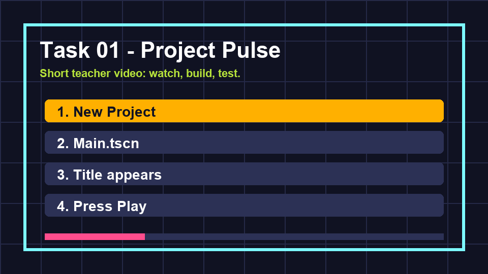

# Task 01 - Project Pulse

**Goal:** create a new Godot project and make one scene that runs.

**Checkpoint:** pressing Play opens a dark window with the title `NEON DRIFT`.

{ .media-frame }

## Key Words

| Word | Meaning |
| --- | --- |
| Project | The folder that stores all files for one game. |
| Scene | A saved collection of nodes. In this task, the scene is the first screen of the game. |
| Node | A building block. Text, cameras, collision boxes, and sound players are all different kinds of nodes. |
| Root node | The top node in a scene. Other nodes sit underneath it. |
| Main scene | The scene Godot opens first when the game starts. |

## Video

Watch the task clip before you start.

{ .media-frame }

## 1. Make The Project

1. Open Godot 4.
2. Select **New Project**.
3. Project name: `NeonDrift`.
4. Choose an empty folder for the project.
5. Renderer: choose **Compatibility**.
6. Select **Create & Edit**.

### What This Means

The renderer controls how Godot draws the game. Compatibility is a sensible beginner choice because it works on more computers.

## 2. Make Folders

In the FileSystem dock, make these folders:

| Folder | What will go in it |
| --- | --- |
| `scenes` | Saved Godot scenes such as `Main.tscn` and `Player.tscn`. |
| `scripts` | Code files ending in `.gd`. |
| `art` | Sprites, icons, and images. |
| `audio` | Music and sound effects. |

!!! note "FileSystem dock"
    The FileSystem dock is usually at the bottom-left of the Godot editor. It shows the files inside the project folder.

## 3. Create The Main Scene

1. In the Scene dock, choose **2D Scene**.
2. Rename the new root node to `Main`.
3. Save the scene as `scenes/Main.tscn`.

### What This Means

`Main.tscn` will become the whole game screen. Later, the player, sparks, enemies, score, and timer will all be placed inside this scene.

## 4. Add A Background

1. Right-click `Main`.
2. Choose **Add Child Node**.
3. Search for `CanvasLayer` and add it.
4. Right-click `CanvasLayer`.
5. Add a `ColorRect`.
6. In the Inspector, set the `ColorRect` colour to a very dark blue or black.
7. Set its anchors to **Full Rect** so it fills the window.

### What This Means

A `CanvasLayer` is useful for screen objects like backgrounds, labels, buttons, and HUDs. A `ColorRect` is a rectangle of colour.

## 5. Add The Title

1. Right-click `CanvasLayer`.
2. Add a `Label`.
3. In the Inspector, set **Text** to `NEON DRIFT`.
4. Move the label near the centre of the screen.
5. Increase the font size if your Godot version shows that option in **Theme Overrides > Font Sizes**.

## 6. Add A Tiny Script

1. Select the `Main` node.
2. Click the script icon at the top of the Scene dock.
3. Save the script as `scripts/main.gd`.
4. Replace the script with this:

```gdscript
extends Node2D

func _ready() -> void:
    print("Neon Drift online")
```

### Code Translation

| Code | Meaning |
| --- | --- |
| `extends Node2D` | This script belongs to a 2D node. |
| `func _ready()` | Run this code when the node is ready. |
| `print(...)` | Show a message in the Output panel. |

## 7. Set The Main Scene

1. Press Play.
2. Godot may ask you to choose a main scene.
3. Choose **Select Current**.

If Godot does not ask:

1. Go to **Project > Project Settings > Application > Run**.
2. Set **Main Scene** to `scenes/Main.tscn`.

## Checkpoint

You are ready for the next page when:

- [ ] Pressing Play opens the game window.
- [ ] The title `NEON DRIFT` is visible.
- [ ] The Output panel says `Neon Drift online`.
- [ ] The scene is saved as `scenes/Main.tscn`.

## If It Does Not Work

| Problem | Try this |
| --- | --- |
| The game opens a blank window | Check that `Main.tscn` is the main scene. |
| The title is missing | Select the `Label` and check its Text property. |
| The background does not fill the window | Select `ColorRect` and choose Full Rect anchors. |
| No output message appears | Check the script is attached to `Main`. |

Next: [Task 02 - Player movement](02-player-movement.md).
