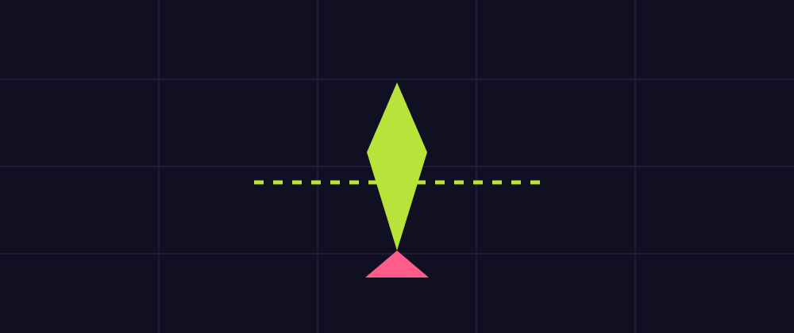

# Task 02 - Player Movement

**Goal:** make a ship move with the keyboard.

**Checkpoint:** the ship moves with WASD or arrow keys and cannot leave the window.

{ .media-frame }

## Key Words

| Word | Meaning |
| --- | --- |
| Player | The object controlled by the person playing. |
| CharacterBody2D | A Godot node made for moving 2D characters with collision. |
| Collision | The invisible shape Godot uses to know when things touch. |
| Velocity | Speed and direction together. |
| Input | Keyboard, mouse, controller, or touch actions from the player. |

## Video

Watch first.

<iframe class="video-frame" src="https://www.youtube.com/embed/CQ36QANa44M" title="YouTube video: Godot 4 top-down movement" allowfullscreen></iframe>

## 1. Make A Player Scene

1. Create a new scene.
2. Choose **Other Node**.
3. Search for `CharacterBody2D`.
4. Rename it to `Player`.
5. Save it as `scenes/Player.tscn`.

### What This Means

We are making the player as a separate scene so it can be reused and edited without cluttering the main game scene.

## 2. Make The Player Visible

1. Right-click `Player`.
2. Add a `Polygon2D`.
3. In the Inspector, find **Polygon**.
4. Create a simple triangle shape.
5. Set the colour to cyan, green, or another bright arcade colour.

Suggested triangle points:

```text
(0, -20)
(16, 16)
(-16, 16)
```

### What This Means

The `Polygon2D` is only the drawing. It lets us see the ship, but it does not create collision by itself.

## 3. Add Collision

1. Right-click `Player`.
2. Add a `CollisionShape2D`.
3. Select the new `CollisionShape2D`.
4. In the Inspector, set **Shape** to **New CircleShape2D**.
5. Set the radius to about `18`.

### What This Means

Collision is invisible during the game. It is the shape Godot uses for bumps, walls, collectibles, and enemies.

## 4. Attach The Movement Script

1. Select `Player`.
2. Click the script icon.
3. Save the script as `scripts/player.gd`.
4. Replace the code with this:

```gdscript
extends CharacterBody2D

@export var speed := 420.0

func _physics_process(_delta: float) -> void:
    var input_vector := Input.get_vector("ui_left", "ui_right", "ui_up", "ui_down")
    velocity = input_vector * speed
    move_and_slide()
    global_position.x = clamp(global_position.x, 24.0, 1256.0)
    global_position.y = clamp(global_position.y, 24.0, 696.0)
```

### Code Translation

| Code | Meaning |
| --- | --- |
| `@export var speed` | Show the speed value in the Inspector so it can be changed without editing code. |
| `_physics_process` | Runs many times per second for movement and collision. |
| `Input.get_vector(...)` | Reads left, right, up, and down input as one direction. |
| `velocity = input_vector * speed` | Turns input into movement speed. |
| `move_and_slide()` | Moves the player and handles simple collision. |
| `clamp(...)` | Keeps a value between a minimum and maximum. |

## 5. Put The Player In The Game

1. Open `scenes/Main.tscn`.
2. Drag `Player.tscn` from the FileSystem into the scene.
3. Place it near the centre of the window.
4. Select the `Player` node.
5. In the Node dock, open **Groups**.
6. Add it to a group called `player`.

### What This Means

A group is a label. Later, sparks and enemies can ask, "Is the thing touching me in the player group?"

## 6. Test And Tune

1. Press Play.
2. Try arrow keys.
3. Try WASD.
4. Change the exported `speed` value in the Inspector if the ship feels too slow or too fast.

## Checkpoint

You are ready for the next page when:

- [ ] The player appears in the game.
- [ ] The player moves left, right, up, and down.
- [ ] The player stays inside the window.
- [ ] The player is in the `player` group.

## If It Does Not Work

| Problem | Try this |
| --- | --- |
| The ship does not move | Check the script is attached to the `Player` root node. |
| Error says an input action is missing | Use the built-in `ui_left`, `ui_right`, `ui_up`, and `ui_down` actions exactly as written. |
| The ship is invisible | Check the `Polygon2D` colour and position. |
| The ship leaves the window | Check the two `clamp` lines are copied correctly. |

Next: [Task 03 - The arena](03-the-arena.md).
