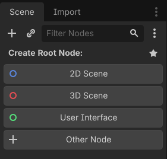
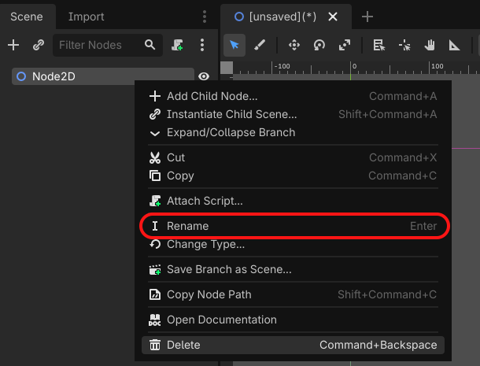
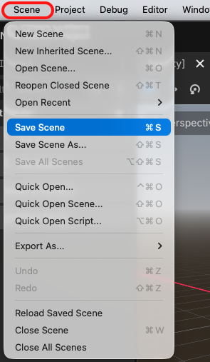

# Task 3: Create `Main.tscn`

## Goal

Create the first scene the game will run.

## Do This

1. In the **Scene** panel at the top left, click **2D Scene**.

    

2. Right-click the new `Node2D` in that panel and choose **Rename**.

    

3. Type `Main` and press **Enter**.

4. From the top menu, choose **Scene > Save Scene**.

    

5. Double-click the `scenes` folder, enter `Main.tscn` in the **File** box, and click **Save**.

## Check

You should see `Main` in the **Scene** panel and `scenes/Main.tscn` in the **FileSystem** panel.
