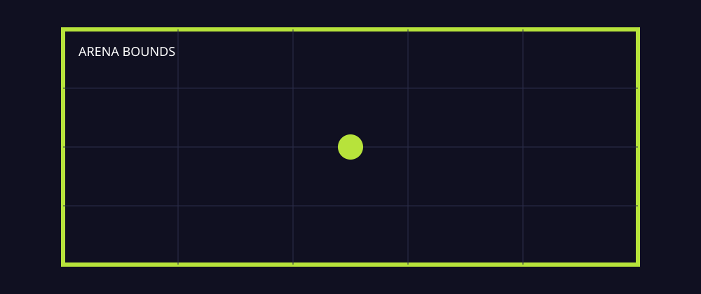

# Task 03 - The Arena

**Goal:** create a clear play space so the player knows where the game happens.

**Checkpoint:** the player is framed by a visible border and cannot move beyond the arena.

{ .media-frame }

## Key Words

| Word | Meaning |
| --- | --- |
| Arena | The area where the game action happens. |
| Boundary | An edge or wall that marks where the player can go. |
| StaticBody2D | A 2D body that does not move, often used for floors and walls. |
| Draw function | Code that tells Godot to draw simple shapes or lines. |
| Viewport | The game window area the player sees. |

## Video

Watch first.

<iframe class="video-frame" src="https://www.youtube.com/embed/GwCiGixlqiU" title="YouTube video: Your First 2D Game From Zero with Godot 4" allowfullscreen></iframe>

## 1. Add An Arena Drawing Node

1. Open `scenes/Main.tscn`.
2. Right-click `Main`.
3. Add a `Node2D`.
4. Rename it `ArenaArt`.
5. Attach a new script called `scripts/arena_art.gd`.

Paste this code:

```gdscript
extends Node2D

func _draw() -> void:
    var grid_colour := Color("24243d")
    var border_colour := Color("7df9ff")

    for x in range(0, 1281, 64):
        draw_line(Vector2(x, 0), Vector2(x, 720), grid_colour, 1.0)

    for y in range(0, 721, 64):
        draw_line(Vector2(0, y), Vector2(1280, y), grid_colour, 1.0)

    draw_rect(Rect2(16, 16, 1248, 688), border_colour, false, 4.0)
```

### Code Translation

| Code | Meaning |
| --- | --- |
| `_draw()` | A special function Godot uses when a node draws custom shapes. |
| `Color("24243d")` | A colour written as a hexadecimal colour code. |
| `range(0, 1281, 64)` | Count from 0 to 1280 in steps of 64. |
| `draw_line(...)` | Draw one line between two points. |
| `draw_rect(...)` | Draw a rectangle around the arena. |

## 2. Add Wall Collision

1. Right-click `Main`.
2. Add a `StaticBody2D`.
3. Rename it `ArenaBounds`.
4. Add four `CollisionShape2D` children.
5. Name them `TopWall`, `BottomWall`, `LeftWall`, and `RightWall`.
6. Give each one a `RectangleShape2D`.

Use these approximate sizes and positions:

| Wall | Position | Size |
| --- | --- | --- |
| `TopWall` | `x 640`, `y 8` | `1280 x 16` |
| `BottomWall` | `x 640`, `y 712` | `1280 x 16` |
| `LeftWall` | `x 8`, `y 360` | `16 x 720` |
| `RightWall` | `x 1272`, `y 360` | `16 x 720` |

### What This Means

The bright border is what the player sees. The `CollisionShape2D` walls are what Godot feels. We need both.

## 3. Test Every Wall

1. Press Play.
2. Move into the top wall.
3. Move into the bottom wall.
4. Move into the left wall.
5. Move into the right wall.

!!! warning "Do not skip this"
    A wall that looks correct but has no collision will cause confusing bugs later. Test all four sides now.

## Checkpoint

You are ready for the next page when:

- [ ] The arena has a visible grid or border.
- [ ] The player cannot leave through the top.
- [ ] The player cannot leave through the bottom.
- [ ] The player cannot leave through the left.
- [ ] The player cannot leave through the right.

## If It Does Not Work

| Problem | Try this |
| --- | --- |
| No grid appears | Check the script is attached to `ArenaArt`. |
| Grid appears over the player | Move `ArenaArt` above the player in the Scene dock so it draws first. |
| Player passes through walls | Check the player has a `CollisionShape2D` and each wall has a `RectangleShape2D`. |
| The border does not fit the window | Check the project window size is still `1280 x 720` or adjust the numbers to match your window. |

Next: [Task 04 - Collect the sparks](04-collect-the-sparks.md).
