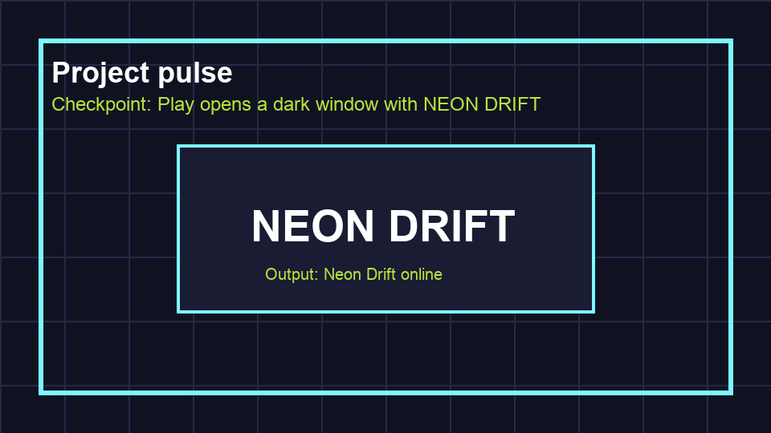

# Task 4: Add A Background

## Goal

Add a dark background to the game window.

## Do This

The **Scene panel** is the list of nodes at the top-left. For this background, you do not need to add a node. Godot already has a setting for the empty space behind a 2D game.

1. Open **Project > Project Settings**. Choose **Display > Window > Size**.
2. Set **Viewport Width** to `1280` and **Viewport Height** to `720`, then close Project Settings.
3. Open **Project > Project Settings** again.
4. Choose **General > Rendering > Environment > Default Clear Color**.
5. Click the colour box and choose a very dark blue.
6. Close Project Settings and save the scene.

## Check

Press **F6** to run this scene, then click **Run Current Scene** if Godot asks. The game window should be filled with dark blue and there should be no node warning. Close the game window when finished.
