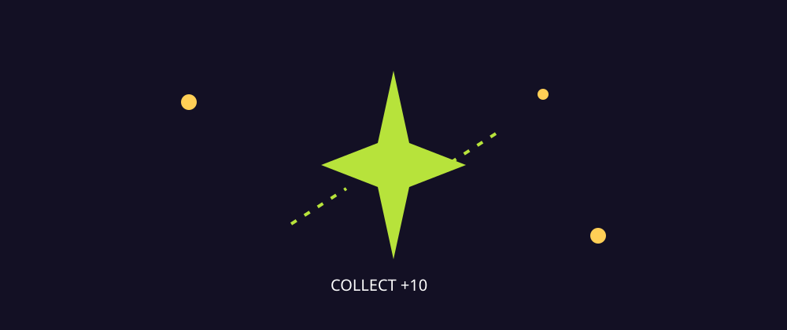
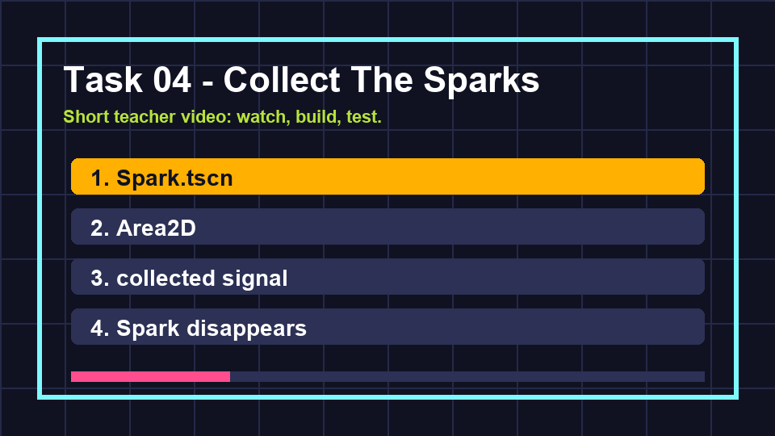

# Task 04 - Collect The Sparks

**Goal:** add a collectible spark that disappears when the player touches it.

**Checkpoint:** touching a spark removes it and prints its score value in the Output panel.

{ .media-frame }

## Key Words

| Word | Meaning |
| --- | --- |
| Collectible | An object the player can pick up. |
| Area2D | A 2D node that detects when something enters or leaves an area. |
| Signal | A message one node sends when something happens. |
| Emit | Send a signal. |
| Instance | A copy of a scene placed inside another scene. |

## Video

Watch the task clip before you start.

{ .media-frame }

## 1. Make A Spark Scene

1. Create a new scene.
2. Choose **Other Node**.
3. Search for `Area2D`.
4. Rename it `Spark`.
5. Save it as `scenes/Spark.tscn`.

### What This Means

`Area2D` is good for pickups because it can notice touch without acting like a solid wall.

## 2. Make The Spark Visible

1. Right-click `Spark`.
2. Add a `Polygon2D`.
3. Make a small diamond or square.
4. Set the colour to yellow or lime.

Suggested diamond points:

```text
(0, -12)
(12, 0)
(0, 12)
(-12, 0)
```

## 3. Add Spark Collision

1. Right-click `Spark`.
2. Add a `CollisionShape2D`.
3. Set **Shape** to **New CircleShape2D**.
4. Set the radius to about `14`.

## 4. Attach The Spark Script

1. Select the `Spark` root node.
2. Attach a new script called `scripts/spark.gd`.
3. Paste this code:

```gdscript
extends Area2D

signal collected(value: int)

@export var value := 10

func _ready() -> void:
    body_entered.connect(_on_body_entered)

func _on_body_entered(body: Node2D) -> void:
    if body.is_in_group("player"):
        collected.emit(value)
        queue_free()
```

### Code Translation

| Code | Meaning |
| --- | --- |
| `signal collected(value: int)` | Make a custom message called `collected` that sends a number. |
| `@export var value := 10` | Each spark is worth 10 points by default. |
| `body_entered.connect(...)` | When a body enters the area, run our function. |
| `body.is_in_group("player")` | Only react if the thing touching the spark is the player. |
| `collected.emit(value)` | Send the collected message. |
| `queue_free()` | Remove this spark safely from the game. |

## 5. Add Sparks To The Arena

1. Open `scenes/Main.tscn`.
2. Drag `Spark.tscn` into the scene six times.
3. Spread the sparks around the arena.
4. Do not place them inside walls.

## 6. Listen For The Spark Signal

Open `scripts/main.gd` and expand it to this:

```gdscript
extends Node2D

func _ready() -> void:
    print("Neon Drift online")
    for spark in get_tree().get_nodes_in_group("spark"):
        spark.collected.connect(_on_spark_collected)

func _on_spark_collected(value: int) -> void:
    print("Collected spark worth %s points" % value)
```

Now select each spark and add it to a group called `spark`.

### What This Means

The spark owns the moment of being touched. `Main` owns the game score. The signal lets them talk without mixing both jobs into one script.

## Checkpoint

You are ready for the next page when:

- [ ] Sparks are visible in the arena.
- [ ] The player can touch a spark.
- [ ] The touched spark disappears.
- [ ] The Output panel prints the spark value.

## If It Does Not Work

| Problem | Try this |
| --- | --- |
| Spark does not disappear | Check the player is in the `player` group. |
| Spark disappears but no message prints | Check each spark is in the `spark` group. |
| Error says `collected` does not exist | Check the spark script is attached to the `Spark` root node. |
| Player bounces off the spark | Check the spark root is `Area2D`, not `StaticBody2D`. |

Next: [Task 05 - Enemy pressure](05-enemy-pressure.md).
