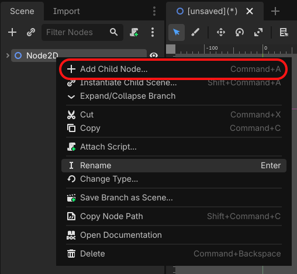
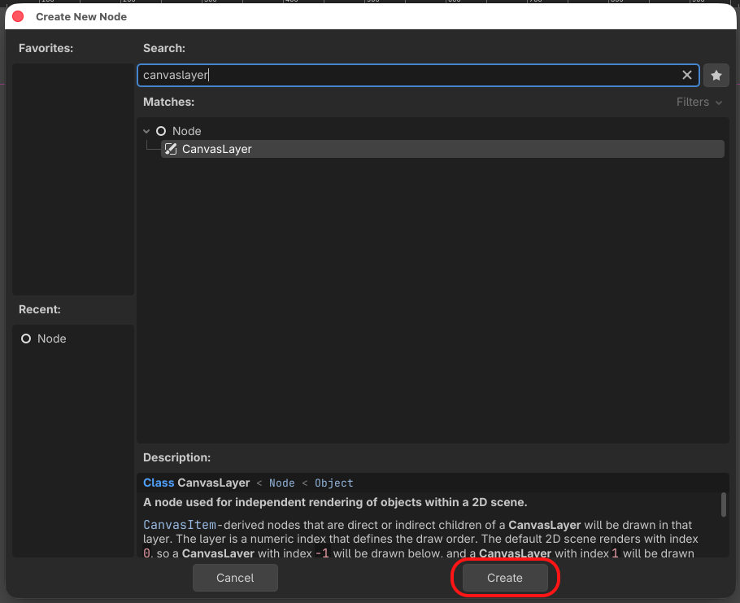

# Task 5: Add The Title

Add NEON DRIFT at the top of your game window.

## 1. Add a layer for the title

Use the **Scene panel at the top left**.

1. Right-click Main and choose **Add Child Node**.

    

    *Your node will be called Main instead of Node2D.*

2. Search for CanvasLayer, select it, and click **Create**.

    

This layer keeps the title above the game.

## 2. Make the title container

1. Right-click CanvasLayer and choose **Add Child Node**.
2. Search for Control, select it, and click **Create**.
3. Right-click Control and choose **Rename**. Type HUD and press Enter.

*The screenshot shows Node2D. Use the same Rename option on your Control node.*

Select HUD. In the **Inspector on the right**, open **Layout**, then **Transform**.

Enter these values:

| Setting | x | y |
| --- | --- | --- |
| Position | 0 | 0 |
| Size | 1280 | 720 |

Leave the other settings as they are. If you see a message about HUD having no Control parent, you can continue.

## 3. Add the words

1. Right-click HUD in the Scene panel and choose **Add Child Node**.
2. Search for Label, select it, and click **Create**.
3. With Label selected, find **Text** in the Inspector and type NEON DRIFT.

## 4. Position and style the title

Keep Label selected. In the Inspector, open **Layout**, then **Transform**.

| Setting | x | y |
| --- | --- | --- |
| Position | 490 | 24 |
| Size | 300 | 70 |

Open **Theme Overrides**, then **Font Sizes**. Set **Font Size** to 48.

To centre the words inside the label:

1. At the top of the Inspector, type horizontal alignment into **Filter Properties**.
2. Set **Horizontal Alignment** to Center.
3. Clear the filter box.

## 5. Save and check

From the top menu, choose **Scene > Save Scene**.

Press **F6** to run the scene.

You should see NEON DRIFT near the top centre of the dark blue game window.

Close the game window when finished.
