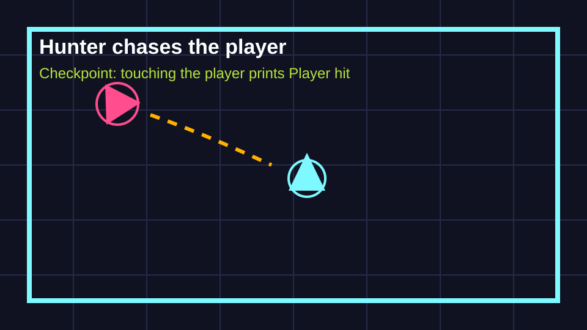
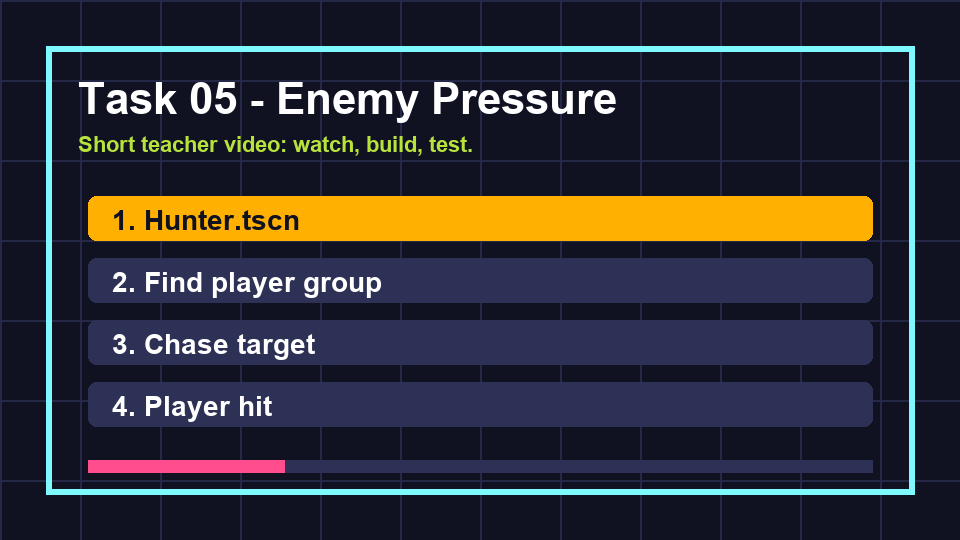

# Task 05 - Enemy Pressure

**Goal:** add a hunter that chases the player and can report a hit.

**Checkpoint:** a hunter moves toward the player, and touching the player prints `Player hit`.

{ .media-frame }

## Key Words

| Word | Meaning |
| --- | --- |
| Enemy | A game object that makes the player's job harder. |
| Target | The object an enemy is trying to move toward. |
| Direction | The way from one point to another. |
| Chase | Movement that constantly aims at the target. |
| Game pressure | The feeling that the player must make decisions quickly. |

## Video

Watch the task clip before you start.

{ .media-frame }

## 1. Make A Hunter Scene

1. Create a new scene.
2. Choose **Other Node**.
3. Search for `CharacterBody2D`.
4. Rename it `Hunter`.
5. Save it as `scenes/Hunter.tscn`.

### What This Means

The hunter moves around the arena, so it uses `CharacterBody2D` like the player.

## 2. Make The Hunter Visible

1. Add a `Polygon2D` child.
2. Make a red or pink triangle, square, or arrow.
3. Add a `CollisionShape2D` child.
4. Set its shape to **New CircleShape2D**.
5. Set the radius to about `18`.

## 3. Attach The Hunter Script

1. Select the `Hunter` root node.
2. Attach a new script called `scripts/hunter.gd`.
3. Paste this code:

```gdscript
extends CharacterBody2D

signal player_hit

@export var speed := 130.0

var target: Node2D

func _ready() -> void:
    target = get_tree().get_first_node_in_group("player") as Node2D

func _physics_process(_delta: float) -> void:
    if target == null:
        return

    velocity = global_position.direction_to(target.global_position) * speed
    move_and_slide()

    for index in get_slide_collision_count():
        var collision := get_slide_collision(index)
        var body := collision.get_collider()
        if body is Node and body.is_in_group("player"):
            player_hit.emit()
```

### Code Translation

| Code | Meaning |
| --- | --- |
| `signal player_hit` | Make a message the hunter can send when it touches the player. |
| `target = ...` | Find the first node in the `player` group. |
| `direction_to(...)` | Work out the direction from the hunter to the player. |
| `move_and_slide()` | Move the hunter and detect sliding collisions. |
| `get_slide_collision_count()` | Count how many things the hunter bumped into this frame. |
| `player_hit.emit()` | Send the hit message. |

## 4. Put Hunters In The Arena

1. Open `scenes/Main.tscn`.
2. Drag `Hunter.tscn` into the scene.
3. Place it near an arena edge, not on top of the player.
4. Add the hunter to a group called `hunter`.
5. Duplicate it two more times if one hunter feels too easy.

Suggested starting positions:

| Hunter | Position |
| --- | --- |
| 1 | Top-left edge |
| 2 | Top-right edge |
| 3 | Bottom edge |

## 5. Listen For Hunter Hits

Open `scripts/main.gd` and add the hunter connection inside `_ready()`:

```gdscript
func _ready() -> void:
    print("Neon Drift online")

    for spark in get_tree().get_nodes_in_group("spark"):
        spark.collected.connect(_on_spark_collected)

    for hunter in get_tree().get_nodes_in_group("hunter"):
        hunter.player_hit.connect(_on_player_hit)
```

Add this function underneath your spark function:

```gdscript
func _on_player_hit() -> void:
    print("Player hit")
```

### What This Means

The hunter does not decide what game over means. It only reports that it touched the player. The `Main` scene will decide what happens next.

## Checkpoint

You are ready for the next page when:

- [ ] At least one hunter is visible.
- [ ] The hunter moves toward the player.
- [ ] The hunter does not start on top of the player.
- [ ] Touching the player prints `Player hit`.
- [ ] The game is still playable, not instantly impossible.

## If It Does Not Work

| Problem | Try this |
| --- | --- |
| Hunter does not move | Check the player is in the `player` group. |
| Hunter is invisible | Check the `Polygon2D` colour and position. |
| No hit message prints | Check the hunter is in the `hunter` group and has the script attached. |
| Game is too hard | Lower hunter `speed` or use one hunter for now. |

Next: [Task 06 - Score and survive](06-score-and-survive.md).
