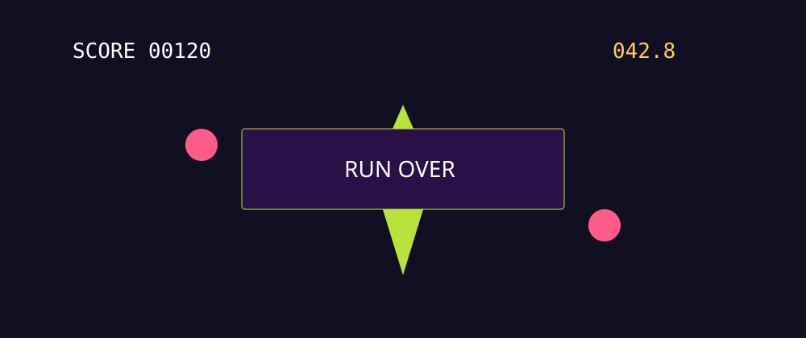

# Task 06 - Score And Survive

**Goal:** turn the pieces into a complete arcade loop.

**Checkpoint:** the HUD shows score and time, collecting sparks increases score, a hunter ends the run, and the restart button works.

{ .media-frame }

## Key Words

| Word | Meaning |
| --- | --- |
| HUD | Heads-up display. Information shown on top of the game, such as score and time. |
| Score | Points earned by the player. |
| Timer | A clock that counts time. |
| Game over | The state when the run has ended. |
| Reload | Restart the current scene from the beginning. |

## Video

Teacher clip to record: build the HUD nodes, paste the complete `Main` script, collect a spark, hit a hunter, and restart.

```html
<!-- Optional local video once recorded:
<video controls width="100%" src="../assets/videos/task-06-score-and-survive.mp4"></video>
-->
```

## 1. Build The HUD

Open `scenes/Main.tscn`. Inside the existing `CanvasLayer`, add these nodes:

```text
CanvasLayer
  ScoreLabel
  TimeLabel
  GameOverPanel
    GameOverLabel
    RestartButton
```

Use these node types:

| Node name | Type | Text |
| --- | --- | --- |
| `ScoreLabel` | `Label` | `SCORE 00000` |
| `TimeLabel` | `Label` | `TIME 60.0` |
| `GameOverPanel` | `Panel` | No text |
| `GameOverLabel` | `Label` | `GAME OVER` |
| `RestartButton` | `Button` | `RESTART` |

Set `GameOverPanel` to hidden by unticking **Visible** in the Inspector.

### What This Means

The HUD is not part of the game world. It sits on top of the game so the player can always read it.

## 2. Replace The Main Script

Open `scripts/main.gd` and replace it with this complete version:

```gdscript
extends Node2D

var score := 0
var time_left := 60.0
var running := true

@onready var score_label: Label = $CanvasLayer/ScoreLabel
@onready var time_label: Label = $CanvasLayer/TimeLabel
@onready var game_over_panel: Panel = $CanvasLayer/GameOverPanel
@onready var game_over_label: Label = $CanvasLayer/GameOverPanel/GameOverLabel
@onready var restart_button: Button = $CanvasLayer/GameOverPanel/RestartButton

func _ready() -> void:
    print("Neon Drift online")
    game_over_panel.visible = false
    restart_button.pressed.connect(_on_restart_pressed)

    for spark in get_tree().get_nodes_in_group("spark"):
        spark.collected.connect(_on_spark_collected)

    for hunter in get_tree().get_nodes_in_group("hunter"):
        hunter.player_hit.connect(_on_player_hit)

    update_hud()

func _process(delta: float) -> void:
    if not running:
        return

    time_left -= delta
    if time_left <= 0.0:
        time_left = 0.0
        end_run("TIME UP")

    update_hud()

func _on_spark_collected(value: int) -> void:
    if not running:
        return

    score += value
    update_hud()

func _on_player_hit() -> void:
    end_run("GAME OVER")

func end_run(message: String) -> void:
    if not running:
        return

    running = false
    game_over_label.text = message
    game_over_panel.visible = true

func update_hud() -> void:
    score_label.text = "SCORE %05d" % score
    time_label.text = "TIME %04.1f" % time_left

func _on_restart_pressed() -> void:
    get_tree().reload_current_scene()
```

## Code Translation

| Code | Meaning |
| --- | --- |
| `score` | Stores the player's points. |
| `time_left` | Stores how many seconds remain in the run. |
| `running` | Stops score and time changing after game over. |
| `@onready var` | Wait until the scene is ready, then find a node. |
| `$CanvasLayer/ScoreLabel` | A path to a node in the Scene dock. |
| `_process(delta)` | Runs every frame. `delta` is the time since the last frame. |
| `reload_current_scene()` | Restart the whole current scene. |

## 3. Check The Node Paths

The code uses exact names. These must match the Scene dock exactly:

- `CanvasLayer`
- `ScoreLabel`
- `TimeLabel`
- `GameOverPanel`
- `GameOverLabel`
- `RestartButton`

Capital letters matter.

## 4. Test The Loop

1. Press Play.
2. Collect one spark.
3. Check that the score increases.
4. Let a hunter touch the player.
5. Check that the game-over panel appears.
6. Press the restart button.
7. Check the score resets and the game begins again.

## Checkpoint

You are ready for the next page when:

- [ ] The score starts at `00000`.
- [ ] The timer counts down from `60.0`.
- [ ] Sparks increase the score.
- [ ] A hunter ends the run.
- [ ] The restart button reloads the scene.

## If It Does Not Work

| Problem | Try this |
| --- | --- |
| Error mentions a missing node | Check spelling and capital letters in the Scene dock. |
| Score does not change | Check sparks are in the `spark` group and emit `collected`. |
| Game over does not appear | Check hunters are in the `hunter` group and emit `player_hit`. |
| Restart button does nothing | Check the button is named `RestartButton` and is inside `GameOverPanel`. |

Next: [Task 07 - Juice the loop](07-juice-the-loop.md).
