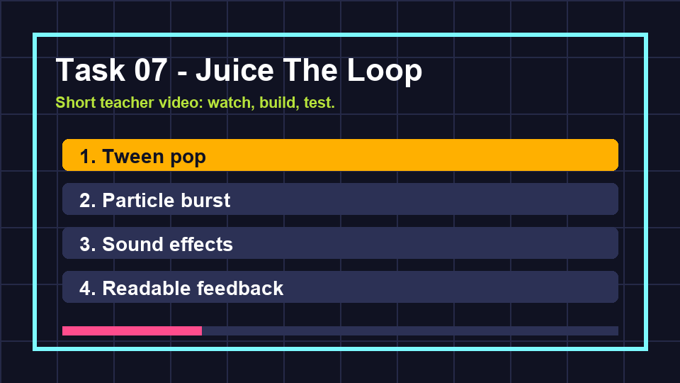

# Task 07 - Juice The Loop

**Goal:** make important actions easy to see and hear.

**Checkpoint:** collecting a spark, being hit, and reaching game over each have clear feedback.

{ .media-frame }

## Key Words

| Word | Meaning |
| --- | --- |
| Juice | Small effects that make game actions feel clearer and more satisfying. |
| Tween | A Godot helper that changes a value smoothly over time. |
| Particle | A tiny visual effect piece, often used for sparks, smoke, or bursts. |
| Audio bus | A sound channel used to control groups of sounds. |
| Feedback | Something the game shows or plays so the player understands what happened. |

## Video

Watch the task clip before you start. Your teacher can replace this clip with a classroom recording later.

{ .media-frame }

## 1. Improve Spark Collection

Open `scripts/spark.gd` and replace it with this version:

```gdscript
extends Area2D

signal collected(value: int)

@export var value := 10

var collected_already := false

func _ready() -> void:
    body_entered.connect(_on_body_entered)

func _on_body_entered(body: Node2D) -> void:
    if collected_already:
        return

    if body.is_in_group("player"):
        collected_already = true
        monitoring = false
        collected.emit(value)
        pop()

func pop() -> void:
    var tween := create_tween()
    tween.tween_property(self, "scale", Vector2.ONE * 1.6, 0.08)
    tween.tween_property(self, "modulate:a", 0.0, 0.12)
    tween.tween_callback(queue_free)
```

### Code Translation

| Code | Meaning |
| --- | --- |
| `collected_already` | Stops the same spark being collected twice. |
| `monitoring = false` | Stops the Area2D checking for new touches. |
| `create_tween()` | Create a small animation. |
| `tween_property(...)` | Smoothly change one property. |
| `modulate:a` | Change the alpha, which means transparency. |

## 2. Add A Particle Burst

In `Spark.tscn`:

1. Right-click `Spark`.
2. Add `GPUParticles2D`.
3. Rename it `CollectBurst`.
4. In the Inspector, set **Emitting** to off.
5. Set **One Shot** to on.
6. Set **Amount** to around `16`.
7. Set **Lifetime** to around `0.25`.

Then update the `pop()` function:

```gdscript
func pop() -> void:
    $CollectBurst.emitting = true

    var tween := create_tween()
    tween.tween_property(self, "scale", Vector2.ONE * 1.6, 0.08)
    tween.tween_property(self, "modulate:a", 0.0, 0.12)
    tween.tween_interval(0.25)
    tween.tween_callback(queue_free)
```

### What This Means

The spark waits a tiny moment before deleting itself so the particle burst has time to play.

## 3. Add Sound Effects

Add these audio files to the `audio` folder:

| File | When it plays |
| --- | --- |
| `collect.wav` | Spark collected |
| `hit.wav` | Player hit by hunter |
| `music.ogg` | Background loop |

In `scenes/Main.tscn`, add these nodes under `Main`:

```text
CollectSound   AudioStreamPlayer
HitSound       AudioStreamPlayer
MusicPlayer    AudioStreamPlayer
```

Set each node's **Stream** property to the matching audio file. Set `MusicPlayer` to **Autoplay**.

## 4. Play The Sounds From Main

In `scripts/main.gd`, add these variables near the other `@onready` variables:

```gdscript
@onready var collect_sound: AudioStreamPlayer = $CollectSound
@onready var hit_sound: AudioStreamPlayer = $HitSound
```

Then update these two functions:

```gdscript
func _on_spark_collected(value: int) -> void:
    if not running:
        return

    score += value
    collect_sound.play()
    update_hud()

func _on_player_hit() -> void:
    hit_sound.play()
    end_run("GAME OVER")
```

## 5. Make Game Over Feel Different

When `GameOverPanel` appears, it should feel calmer than the main game.

Simple options:

- Make the panel dark and easy to read.
- Make `GameOverLabel` large.
- Lower the music volume in the Inspector.
- Use a different sound for hit than collect.

!!! tip "Polish has a job"
    Every effect should answer a player question: what happened, where did it happen, and what should I do next?

## Checkpoint

You are ready for the next page when:

- [ ] Sparks animate before disappearing.
- [ ] A visible burst appears when a spark is collected.
- [ ] Collection and hit sounds are different.
- [ ] Game over is easy to notice and easy to read.
- [ ] Effects do not hide the player or make the game harder to understand.

## If It Does Not Work

| Problem | Try this |
| --- | --- |
| Particle burst does not appear | Check the node is named `CollectBurst` and is a child of `Spark`. |
| Spark never disappears | Check `tween_callback(queue_free)` is still in `pop()`. |
| Sound does not play | Check the stream is set on the `AudioStreamPlayer`. |
| Error says `CollectSound` is missing | Check the node is named exactly `CollectSound` under `Main`. |

Next: [Task 08 - Export the cabinet](08-export-the-cabinet.md).
