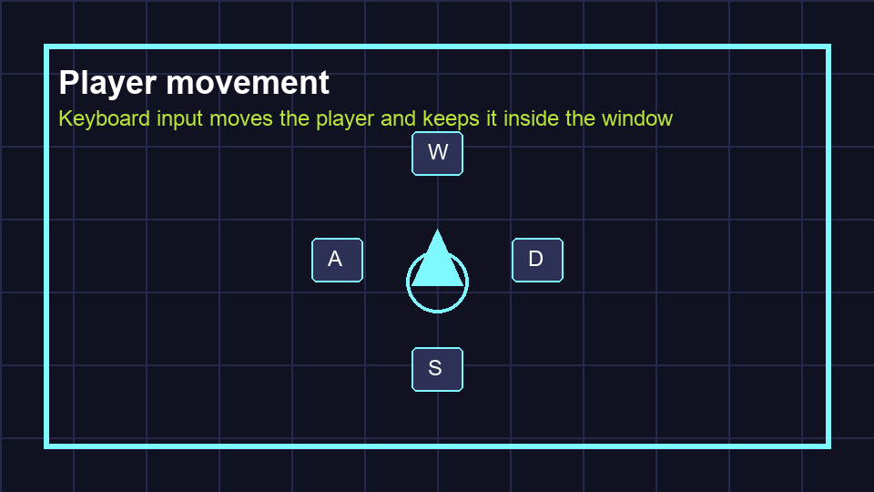

# Task 8: Draw The Player

## Goal

Make the player visible.

## Do This

1. Open `scenes/Player.tscn`.
2. Right-click `Player`, choose **Add Child Node**, search for `Polygon2D`, and click **Create**.
3. Select `Polygon2D`. In the Inspector, click the empty value beside **Polygon** and set its array size to `3`.
4. Expand the array and enter these x and y values:

```text
(0, -20)
(16, 16)
(-16, 16)
```

5. In the Inspector, click the white box beside **Color** and choose a bright arcade colour.



## Check

The 2D view should show a small triangle centred on the crosshair. Press **Ctrl+S** or **Cmd+S**.
