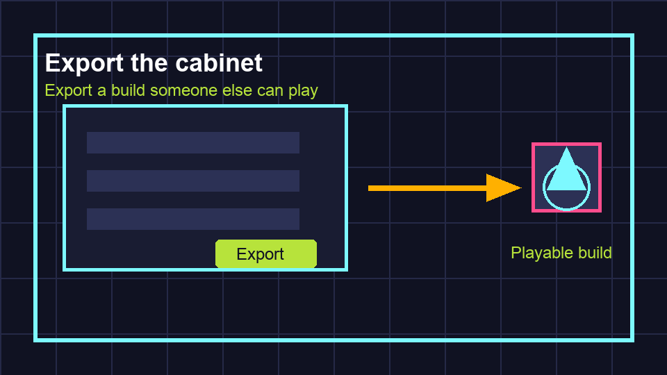

# Task 08 - Export The Cabinet

**Goal:** make a version of the game that someone can play without opening the Godot editor.

**Checkpoint:** the exported game opens, plays, shows game over, and restarts.

{ .media-frame }

## Key Words

| Word | Meaning |
| --- | --- |
| Export | Build the game into files that can be run outside the editor. |
| Preset | A saved group of export settings for one platform, such as Windows or macOS. |
| Build | The exported playable version of the game. |
| Artifact | A final file or folder produced by the project. |
| Playtest | Test the game as a player, not as the developer. |

## Video

Watch first.

<iframe class="video-frame" src="https://www.youtube.com/embed/WoXtLBuK11Y" title="YouTube video: Exporting for Windows in Godot" allowfullscreen></iframe>

## 1. Check The Main Scene

1. Open **Project > Project Settings**.
2. Go to **Application > Run**.
3. Check **Main Scene** is `res://scenes/Main.tscn`.

### What This Means

`res://` means "inside this Godot project". If the main scene is wrong, the exported game may open a blank window.

## 2. Set The Window Size

In **Project Settings**, go to **Display > Window**.

Use these settings:

| Setting | Value |
| --- | --- |
| Viewport Width | `1280` |
| Viewport Height | `720` |
| Stretch Mode | `canvas_items` |
| Stretch Aspect | `keep` |
| Window Title | `Neon Drift Arcade` |

### What This Means

The game was built around a 1280 by 720 play space. These settings help it scale without squashing the game.

## 3. Save Before Exporting

1. Save all open scenes.
2. Save all scripts.
3. Press Play one last time in the editor.
4. Fix any errors before exporting.

!!! warning "Exporting does not fix bugs"
    Exporting packages the game you already have. If it is broken in the editor, it will probably be broken in the build.

## 4. Export The Game

1. Open **Project > Export**.
2. Choose **Add...**.
3. Pick your platform, such as Windows Desktop, macOS, or Linux.
4. If Godot asks for export templates, install them using the prompt.
5. Create a folder called `builds` outside the Godot project folder.
6. Export the game into that `builds` folder.

### What This Means

The `builds` folder is kept separate so generated files do not get mixed up with editable project files.

## 5. Test The Build Like A Player

Close or minimise Godot. Open the exported game from the `builds` folder.

Test this route:

1. The game opens.
2. The title and HUD are visible.
3. The player moves.
4. Sparks can be collected.
5. Hunters can end the run.
6. Game over appears.
7. Restart works.
8. Sound plays at a sensible volume.

## Release Checklist

- [ ] Main scene is assigned.
- [ ] Window size is `1280 x 720`.
- [ ] Player movement works.
- [ ] Sparks increase score.
- [ ] Hunters create game over.
- [ ] Timer reaches time up.
- [ ] Restart reloads the scene.
- [ ] Audio is not painfully loud.
- [ ] Exported build launches without the editor.

## Extension Ideas

Only start these after the exported build works:

- Add a high score.
- Spawn new sparks after collection.
- Add a second enemy type.
- Add a start screen.
- Add controller support.
- Change the theme and rename the game.

## If It Does Not Work

| Problem | Try this |
| --- | --- |
| Export menu says templates are missing | Install export templates from Godot's prompt. |
| Build opens blank | Check the main scene is `res://scenes/Main.tscn`. |
| Window looks stretched | Check stretch mode and aspect settings. |
| Sounds are missing | Check audio files are inside the project, not only on the desktop. |
| Build works only on your computer | Export for the same platform pupils will use. |

You built the loop. Use the [Game loop checklist](../reference/game-loop-checklist.md) to plan the next version.
