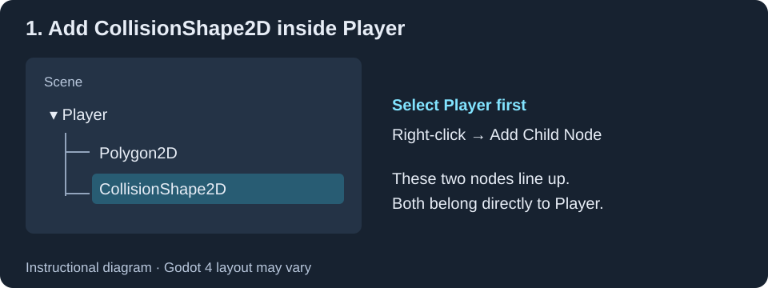
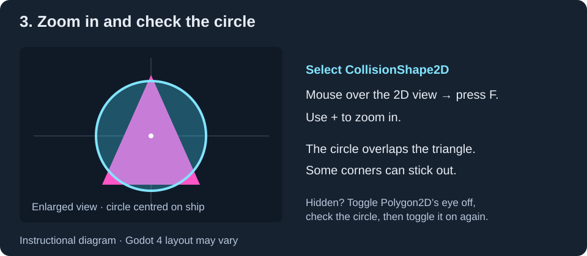

# Task 9: Add Player Collision

## Goal

Add a circle that Godot will use to detect when the player touches something.
The triangle is what the player looks like. The collision circle is the area
Godot checks for contact with walls, sparks and hunters.

## 1. Add the Collision Node

1. Open `scenes/Player.tscn` from the **FileSystem** panel.
2. Click **2D** at the top of the editor to see your triangle.
3. In the **Scene** panel on the left, click **Player**.
4. Right-click **Player** and choose **Add Child Node**.
5. Search for `CollisionShape2D`, select it, then click **Create**.

Your Scene panel should now look like this. Both child nodes must be indented
by the same amount:

```text
Player
├── Polygon2D
└── CollisionShape2D
```



!!! note "There is no circle yet"
    You have added a node to hold the collision shape. Next, you must give it a shape.
    A warning triangle is normal at this point.

## 2. Give It a Circle Shape

1. Click **CollisionShape2D** in the Scene panel.
2. In the **Inspector** on the right, find the **Shape** property.
3. Click the small dropdown arrow at the right of the **Shape** field, which
   currently says **<empty>**.
4. Choose **New CircleShape2D**.
5. Click the circle resource that has replaced **<empty>** to expand its settings.
6. Find **Radius**, type `18`, then press **Enter**.


The radius is the distance from the centre to the edge. A radius of `18` makes
the circle 36 pixels wide, close to the size of the ship from Task 8.

## 3. Find and Check the Circle

1. Keep **CollisionShape2D** selected in the Scene panel.
2. Move your mouse over the central **2D view** and press **F** to focus on the
   selected node.
3. Use the **+** zoom control in the 2D view until the small ship is easy to see.
4. Look for a coloured circle over the triangle. It should be centred on the ship.
   The triangle's corners may stick out slightly; the circle does not need to
   follow every edge.



!!! tip "The triangle is covering the circle"
    In the Scene panel, click the **eye icon** beside **Polygon2D** to hide the
    triangle temporarily. Select **CollisionShape2D** again and inspect the circle.
    Click the eye beside **Polygon2D** again to show your ship before saving.

!!! tip "Still no circle?"
    Select **CollisionShape2D** and check that **Shape** contains a circle resource,
    not **<empty>**, and that **Radius** is `18`. Make sure its eye icon in the
    Scene panel has not been switched off. Under **Transform**, check that its
    **Position** is `x: 0`, `y: 0` so it sits at the centre of the player scene.

## Check

- **Polygon2D** and **CollisionShape2D** are both directly inside **Player**.
- Selecting **CollisionShape2D** lets you see the circle in the 2D editor.
- The circle is centred on your ship.
- The collision-shape warning triangles have disappeared.
- The triangle is visible again after checking the circle.

Press **Ctrl+S** or **Cmd+S** to save.

!!! note "Why is the circle invisible when I run the game?"
    Collision shapes are normally hidden during play. You check this task in the
    **2D editor**. Later, to see collision shapes while testing the game, enable
    **Debug > Visible Collision Shapes** before running it from Godot.
