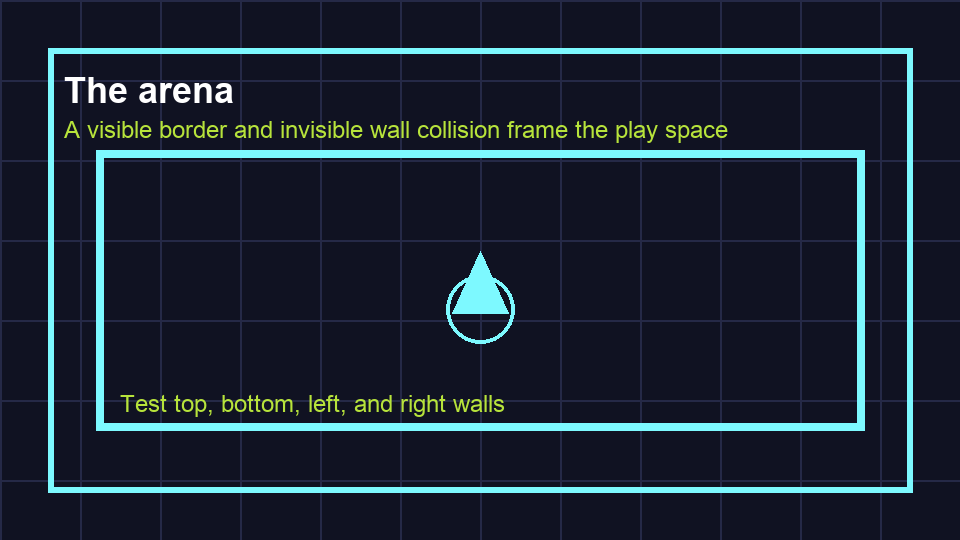

# Task 12: Draw The Arena

## Goal

Draw a clear play area around the game.

## Key Words

| Word | Meaning |
| --- | --- |
| Arena | The area where the game action happens. |
| `_draw()` | A Godot function used to draw lines and shapes. |

## Do This

1. Open `scenes/Main.tscn`.
2. Add a `Node2D` under `Main`.
3. Rename it `ArenaArt`.
4. Attach a script called `scripts/arena_art.gd`.
5. Add this code:

```gdscript
extends Node2D

func _draw() -> void:
    var grid_colour := Color("24243d")
    var border_colour := Color("7df9ff")

    for x in range(0, 1281, 64):
        draw_line(Vector2(x, 0), Vector2(x, 720), grid_colour, 1.0)

    for y in range(0, 721, 64):
        draw_line(Vector2(0, y), Vector2(1280, y), grid_colour, 1.0)

    draw_rect(Rect2(16, 16, 1248, 688), border_colour, false, 4.0)
```



## Check

Press Play. You should see a grid and a bright border.
