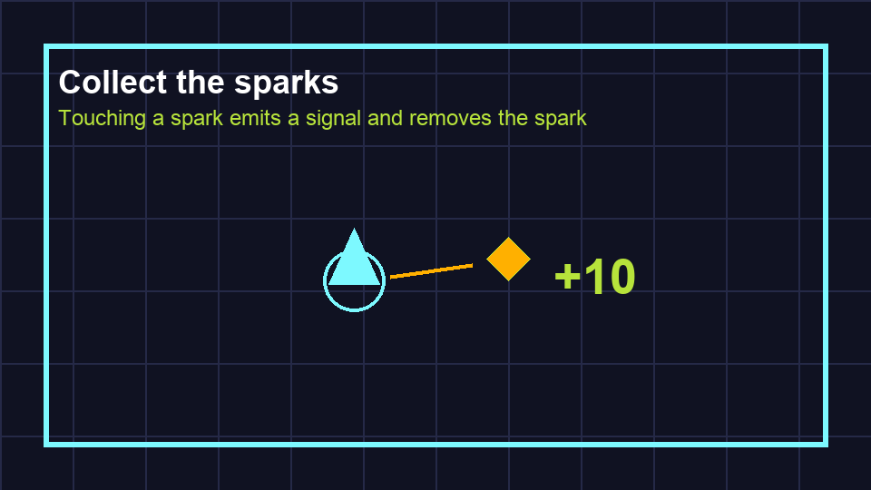

# Task 15: Draw The Spark

## Goal

Make the spark visible and touchable.

## Key Words

| Word | Meaning |
| --- | --- |
| Diamond | A four-point shape used for the spark. |
| Monitoring | Area2D checking whether bodies enter it. |

## Do This

1. Open `scenes/Spark.tscn`.
2. Add a `Polygon2D` child.
3. Make a small diamond using these points:

```text
(0, -12)
(12, 0)
(0, 12)
(-12, 0)
```

4. Set the colour to yellow or lime.
5. Add a `CollisionShape2D`.
6. Set its shape to **New CircleShape2D**.
7. Set the radius to about `14`.



## Check

The spark should be visible and should have a collision shape.
