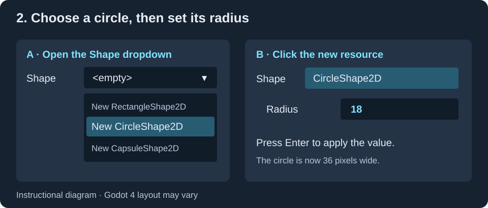

# Task 20: Draw The Hunter

Make the hunter visible and give it a collision shape.

## 1. Add the drawing node

1. Open ==scenes/Hunter.tscn== from the FileSystem panel.

2. In the Scene panel, ==right-click== Hunter and choose **Add Child Node**.

3. Search for ==Polygon2D== and click **Create**.

## 2. Make a diamond

Select Polygon2D. In the Inspector, open **Data**, then **Polygon**. Set the array's **Size** to ==4==.

| Entry | x | y |
| --- | --- | --- |
| 0 | 0 | -20 |
| 1 | 20 | 0 |
| 2 | 0 | 20 |
| 3 | -20 | 0 |

Click the box beside **Color** and choose pink.

## 3. Add the collision circle

1. ==Right-click== Hunter and choose **Add Child Node**.

2. Search for ==CollisionShape2D== and click **Create**.

3. In the Inspector, open the dropdown beside **Shape** and choose **New CircleShape2D**.

4. Click the new circle resource to open its settings. Set **Radius** to ==18==.

## 4. Save and check

Choose **Scene > Save Scene**.

In the 2D editor, select CollisionShape2D. You should see a circle centred over the pink diamond.

Both Polygon2D and CollisionShape2D should sit directly inside Hunter. The collision warning should disappear once you have assigned the circle shape.
