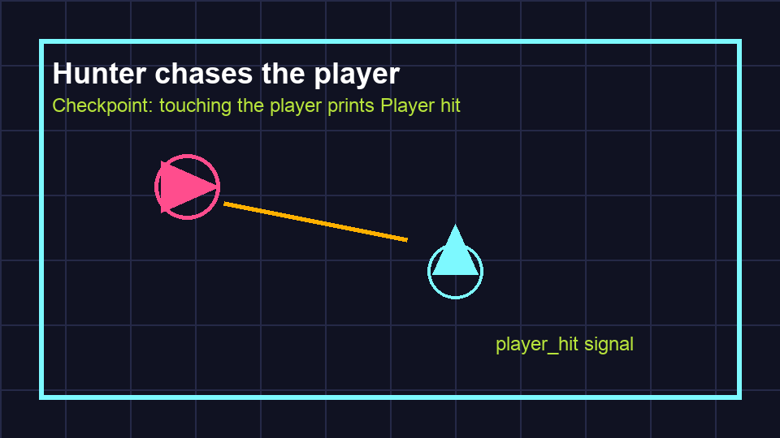

# Task 20: Draw The Hunter

## Goal

Make the hunter visible and touchable.

## Do This

1. Open `scenes/Hunter.tscn`.
2. Add a `Polygon2D` child. Set its **Polygon** array size to `4` and use the points `(0, -20)`, `(20, 0)`, `(0, 20)`, and `(-20, 0)`.
3. Set its **Color** to pink.
4. Add a `CollisionShape2D` as another child of `Hunter`.
5. Beside **Shape**, choose **New CircleShape2D**.
6. Click the new shape and set **Radius** to `18`.

## Check

The hunter should look like a pink diamond with a blue collision circle around it.
