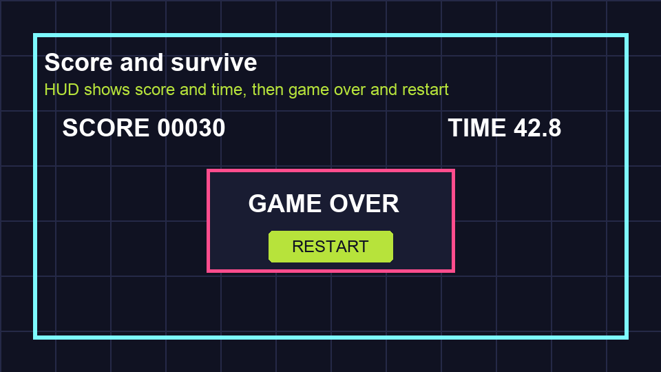

# Task 23: Build The HUD

## Goal

Add score, time, and game-over text to the screen.

## Watch First

<iframe width="100%" height="360" src="https://www.youtube.com/embed/GwCiGixlqiU" title="YouTube video: Godot 4 first 2D game" allowfullscreen></iframe>

## Do This

1. Open `scenes/Main.tscn`.
2. In `CanvasLayer`, add:

```text
ScoreLabel
TimeLabel
GameOverPanel
```

3. Inside `GameOverPanel`, add:

```text
GameOverLabel
RestartButton
```

4. Set `ScoreLabel` text to `SCORE 00000`.
5. Set `TimeLabel` text to `TIME 60.0`.
6. Set `GameOverLabel` text to `GAME OVER`.
7. Set `RestartButton` text to `RESTART`.
8. Hide `GameOverPanel`.



## Check

The HUD should show score and time, but the game-over panel should be hidden.
