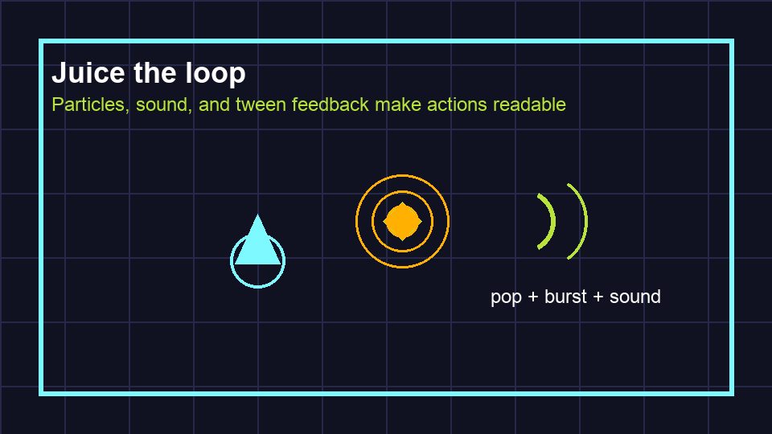

# Task 27: Add Feedback

## Goal

Make the spark pop when collected.

## Watch First

<iframe width="100%" height="360" src="https://www.youtube.com/embed/04TB9gxz-uM" title="YouTube video: How to Tween in Godot 4" allowfullscreen></iframe>

## Do This

1. Open `scenes/Spark.tscn`, select the `Spark` root node, and click its script icon.
2. Replace the whole of `spark.gd` with this complete version:

!!! warning "No script icon?"
    Complete [Task 16: Add Spark Collection](16-add-spark-script.md) first.

```gdscript
extends Area2D

signal collected(value: int)

@export var value := 10

func _ready() -> void:
    body_entered.connect(_on_body_entered)

func _on_body_entered(body: Node2D) -> void:
    if body.is_in_group("player"):
        collected.emit(value)
        pop()

func pop() -> void:
    var tween := create_tween()
    tween.tween_property(self, "scale", Vector2.ONE * 1.6, 0.08)
    tween.tween_property(self, "modulate:a", 0.0, 0.12)
    tween.tween_callback(queue_free)
```



## Check

Collect a spark. It should pop before disappearing.
