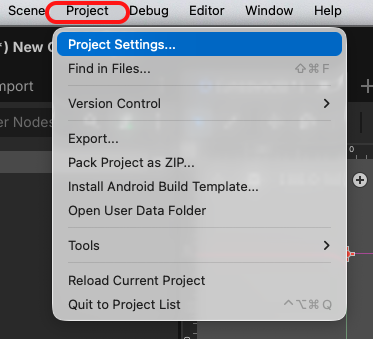
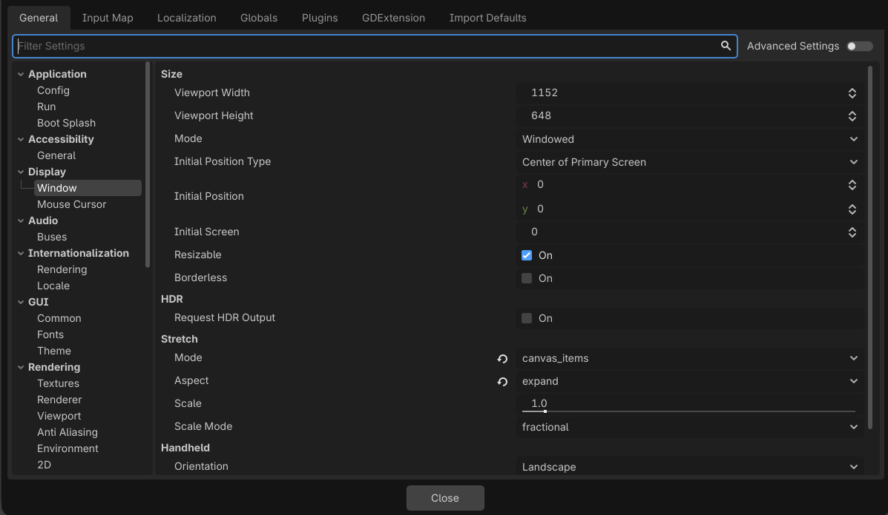

# Task 28: Export The Game

## Goal

Make a build that opens without Godot.

## Watch First

<iframe width="100%" height="360" src="https://www.youtube.com/embed/WoXtLBuK11Y" title="YouTube video: Exporting for Windows in Godot" allowfullscreen></iframe>

## 1. Check the project settings

1. Open **Project > Project Settings**.

    

2. In the **General** tab, choose **Application > Run** and check **Main Scene** is ==res://scenes/Main.tscn==.

3. On the left, click **Window** under **Display**. Under **Size** on the right, check **Viewport Width** is ==1280== and **Viewport Height** is ==720==.

    

4. Close Project Settings.
## 2. Export the game

1. Open **Project > Export**.

2. Click **Add...** and choose the preset for your classroom computer: **Windows Desktop** or **macOS**.

3. Click **Export Project**.

4. Make a folder called ==builds== and save the exported game inside it. Leave **Export With Debug** switched on for this classroom test.

??? tip "Missing export templates?"
    Click **Manage Export Templates**, then download and install the version that
    matches Godot.

## 3. Check

Open the exported game. It should launch, play, show game over, and restart.
